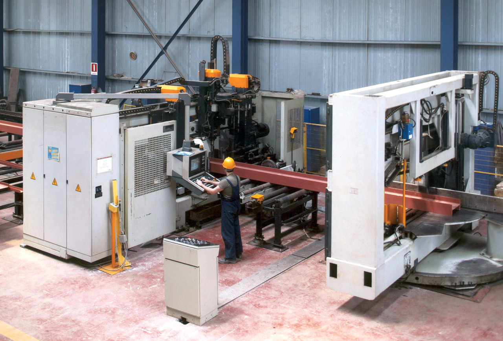
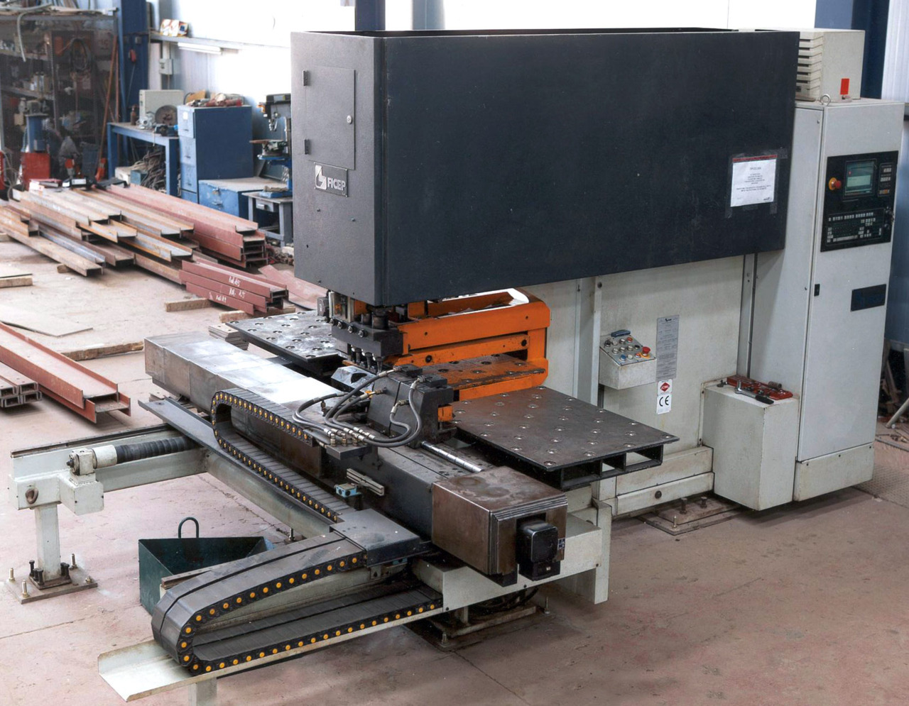

# Our facility

Symmikton S.A. owns a cutting-edge, ISO-certified steel structure facility located at a 6-acre lot in Inofyta, Viotia. The key technological features of this facility are:

* Large daily processing capacity (30 tons of structural steel)
* High precision in the construction process



Interior view of the Symmikton facility in Inofyta, Viotia
{: .caption}

## Lines

Technologicaly advanced machinery gives Symmikton S.A. the capacity to comprehensively address a wide range of steel structures that require production of welded profiles or processing of standard structural steel.

Our facility is based on 5 independent lines:

### Beam line
Automated cutting, drilling and marking of structural steel with section width up to 1,200mm. The accuracy of the machinery is +1/-1mm (non-cumulative). Drilling can be done on 3 axes simultaneously, with 8 different options for the diameter of the holes.

The automated cutting, drilling, and marking station
{: .caption}

Close-up of the 3-axis drilling head
{: .caption}

### Punching line
Automated cutting, drilling and marking of steel angles and plates. Automated CNC machinery employed includes;

* Angle punching for steel angles from 40 x 40mm to 160 x 160mm 
* Plate punching for steel plates up to 1000 x 800 x 25mm 

The angle punching station
{: .caption}

The plate punching station
{: .caption}

### Robot line
Automated plasma-welding and plasma-cutting of structural steel. Includes a Motoman Robot (2001), with space-scanning sensors and moving capability along a 12,000m rail.


The plasma-welding and plasma-cutting robot
{: .caption}

### Beam welding line
Includes T-Master station with dual head submerged arc welding. It has the capability of constructing variable welded profiles up to 2,000mm in height and more than 25,000mm in length.

The T-master station
{: .caption}

The T-master station welding a beam
{: .caption}

### Oxygen & plasma cutting line
Includes fully automated plasma cutter 3,500mm in width and 16,500mm in length, equipped with 5 oxygen torches and 1 plasma torch.

### Shotblasting & shotprimer painting line
Processes steel up to 2,000mm in width and 6,000mm in height.

The shotblasting and shotprimer station
{: .caption}


## Operations & Capacity

In order to achieve the verticalization of these lines, our company has formed a **Structural Steel Design Department**, with experienced engineers and designers. There, we develop models in [Instant Steel](https://eng.ccs.gr/software/steel-structures/instant-steel/), a specialized structural solutions software, produce shop drawings in [Tekla Structures](https://www.tekla.com/us/products/tekla-structures), and push them to the CNC machines through a dedicated terminal to automate production and minimize errors.

Our factory also operates as a cutting-edge **Service Center** for any steel structures contractor. Utilizing the unmatched benefits of our equipment, a contractor can achieve low costs and fast delivery times for structural steel processing works. In the international market, Service Centers are popular since they enable top construction quality without the need for heavy up-front investments.

The flagship project that showcased the huge production capacity of Symmikton S.A., was the construction of the 10,500 ton steel frame for the **International Broadcast Center** in 2002. The project was completed in 5 months (June-October), with our company processing 2000 tons of structural steel per month. This level of speed and efficiency constitutes an insurmountable record for the Steel Structure market in Greece.
