# Steel buildings

Symmikton S.A. undertakes steel building projects, providing integrated design and construction solutions.

## Scope

### Design & permitting

Our experienced **Architectural Department** proposes the functionally and economically optimal location for the building based on the preliminary location plan, while achieving high efficiency in the earthmoving works phase.

The architectural study of the building, as well as its floor plan design is developed in collaboration with the client and his specific functional requirements. At the same time, the company has a Structural Design Department specializing in both concrete and steel structures. The design phase is completed with the integration of electromechanical and fire safety drawings.

Symmikton S.A. has extesive experience in acquiring permits from:

* Ministry of Reconstruction of Production, Environment and Energy
* Ministry of Infrastructure, Transport and Networks
* Forest Service
* Archaeological Service
* Local Governent Services
* Urban Planning Department
* Public Power Coproration

After the acquisition of the building permit and with our expertise in building projects, we guarantee short execution times for all construction operations and excellent worksmanship quality.

### Construction

Our company undertakes:

* Earthmoving
* Concreting
* Industrial Flooring
* Steel Frame Construction
* Coatings
* Plumbing
* Electromechanical Works
* Asphalting

For the steel frame construction phase, Symmikton S.A. owns the most technologically advanced Steel Structure Factory in Greece, fully equiped with robotic machinery (sanding, cutting, piercing, painting) and with a daily processing capacity of 30 tons of steel.

## Projects

### Commercial

| Project                 | Size | Description |
|:--                      |:--   | :--         |
| Ellaktor S.A.           | Total area 70,000m2 Total tonnage 10,500tn | International Broadcast Center Marousi, Attiki |
| Factory Outlet S.A.     | Total area 12,000m2 | Shopping mall Athens International Airport Retail Park |
| Porcelana S.A.          | Total area 10,000m2 | Furniture exhibition building Markopoulo Industrial Zone |
| A.B. Vassilopoulos S.A. | Total area 3,030m2 | Supermarket Vrilissia, Attiki |
| Velmar S.A.             | Total area 990m2 | Auto exhibition building Gerakas, Attiki |
| Sakiotis S.A.           | Total area 600m2 | Office and retail building Pireas, Attiki |

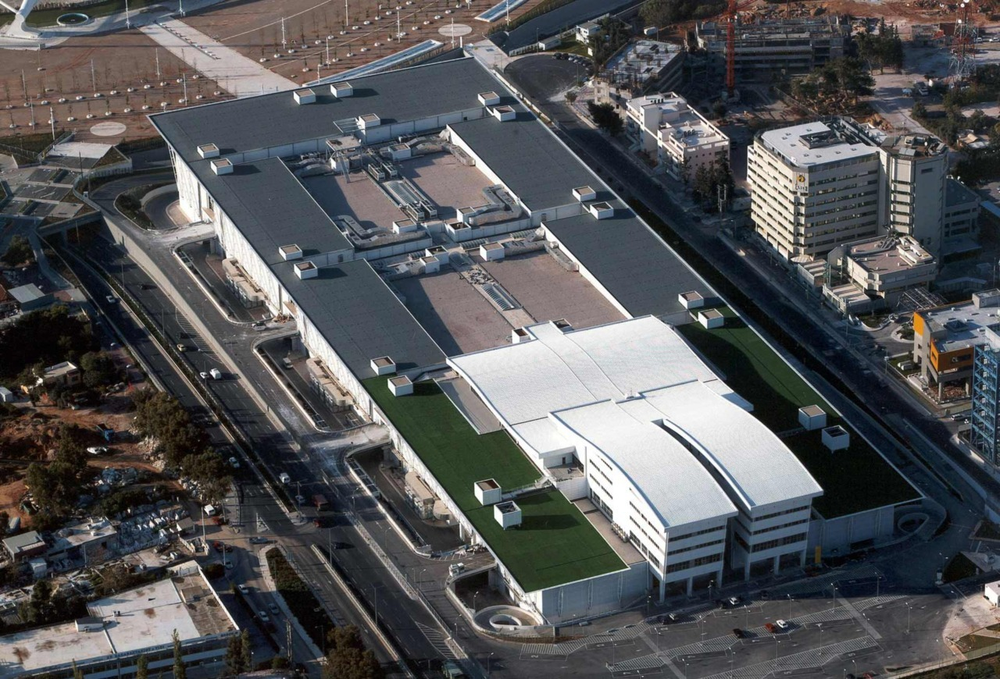
Ellaktor S.A. - aerial view
{: .caption}

Ellaktor S.A. - steel frame erection phase
{: .caption}

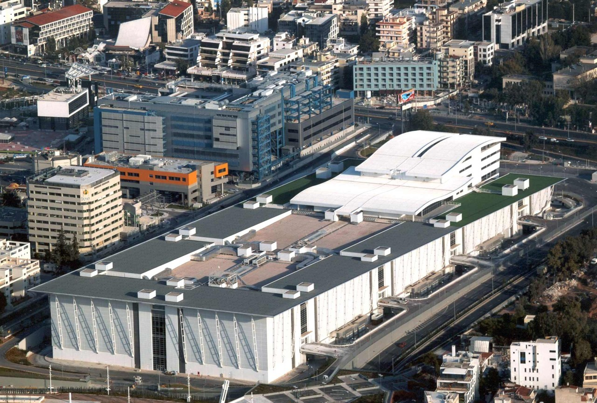
Ellaktor S.A. - aerial view
{: .caption}

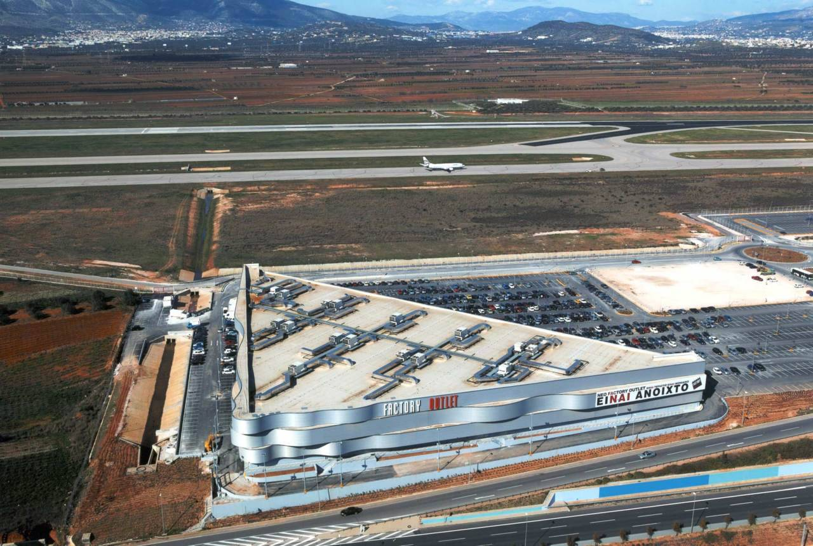
Factory Outlet S.A. - aerial view with the Athens Airport landing strip in the background
{: .caption}

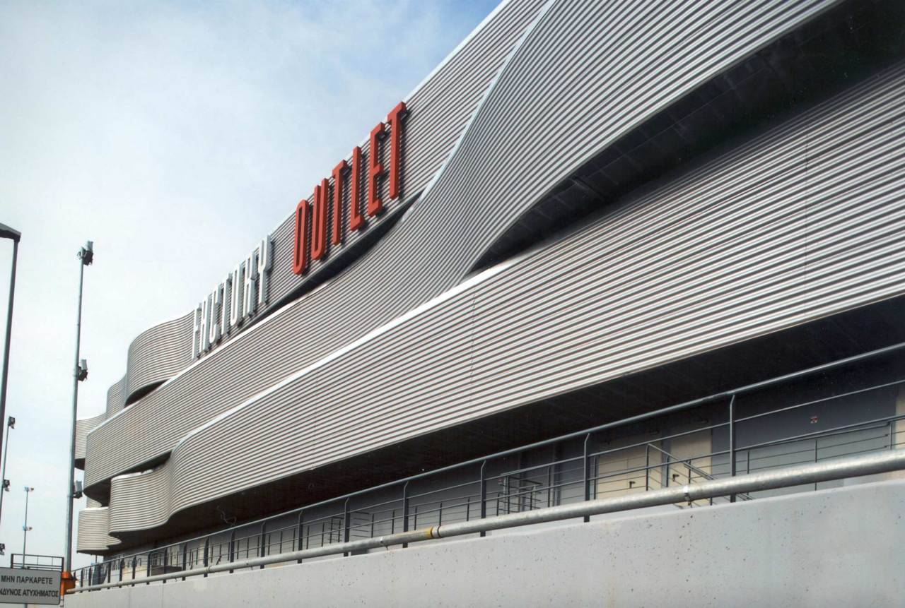
Factory Outlet S.A. - facade close-up
{: .caption}

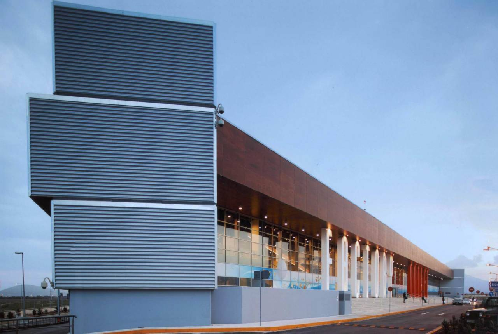
Factory Outlet S.A. - facade close-up
{: .caption}

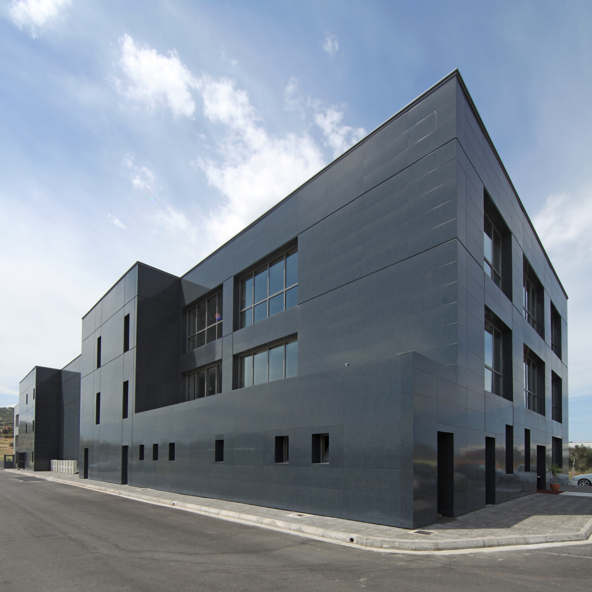
Porcelana S.A. - facade close-up
{: .caption}

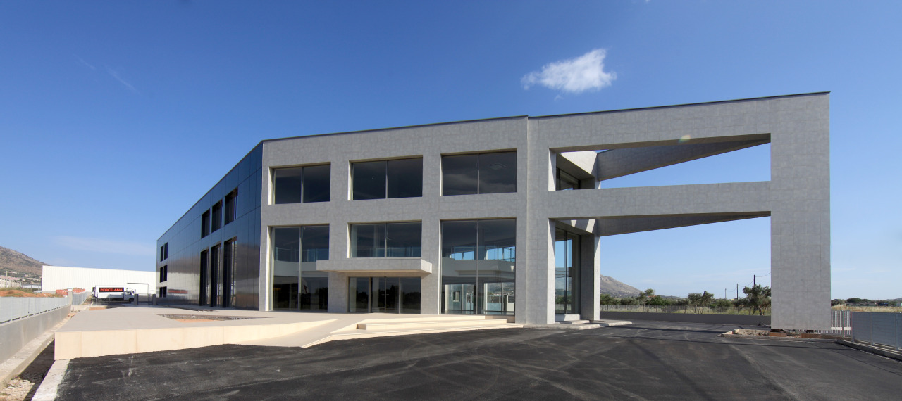
Porcelana S.A. - exterior view
{: .caption}

A.B. Vassilopoulos S.A. - exterior view
{: .caption}

### Manufacturing

| Project              | Size | Description |
|:--                   |:--   | :--         |
| Craft S.A.           | Production 1,200m2 Offices 300m2   | Microbrewery building Peania Industrial Zone |
| Skarlis Marbles S.A. | Production 2,000m2 Offices 300m2   | Marble processing plant Aliveri, Evia |
| Viopremex S.A.       | Production 750m2 Offices 250m2     | Aluminum equipment production plant Thiva, Viotia |
| E.Papadopoulos S.A.  | Production 2,680m2 Offices 340m2   | Wood processing plant with exhibition space Avlonas, Attiki |
| Viamak S.A.          | Production 3,715m2 Offices 200m2   | Textile manufacturing plant Koropi Industrial zone |
| Evobus S.A.          | Production 2,500m2 Offices 550m2   | Auto service plant Koropi industrial zone |
| Filianos S.A.        | Production 3,550m2 Offices 300m2   | Zinc and aluminum die casting plant Schimatari, Viotia |
| F.A. Mourikis S.A.   | Production 3,000m2 Offices 200m2   | Wood processing plant Mandra, Attiki |
| Krivek S.A.          | Production 2,500m2 Offices 500m2   | Food processing and distribution plant Hersonisos, Kriti |
| Media Strom S.A.     | Production 5,000m2 Offices 700m2   | Matress manufacturing plant Markopoulo Industrial Zone |
| Tsanos S.A.          | Production 1,185m2 Offices 200m2   | Bread processing and distribution plant Markopoulo Industrial Zone |
| Kteo Kifisias S.A.      | Total area 1,000m2 | Auto inspection building Marousi, Attiki |
| Kafea S.A.           | Production 2,400m2 Offices 200m2   | Coffee processing and distribution plant Peania Industrial Zone |

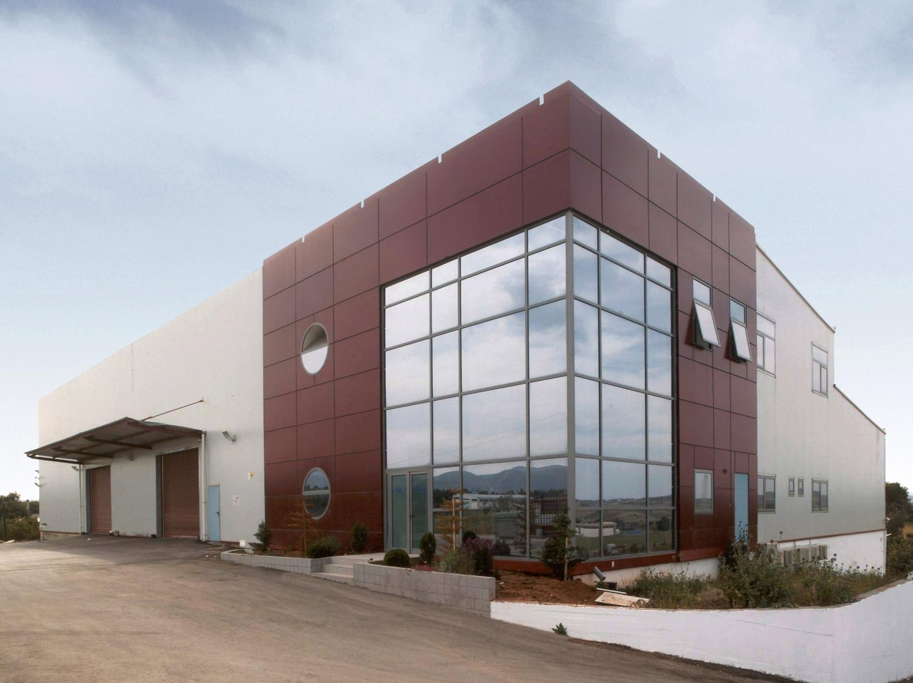
E.Papadopoulos S.A. - exterior view
{: .caption}

Viamak S.A. - exterior view
{: .caption}

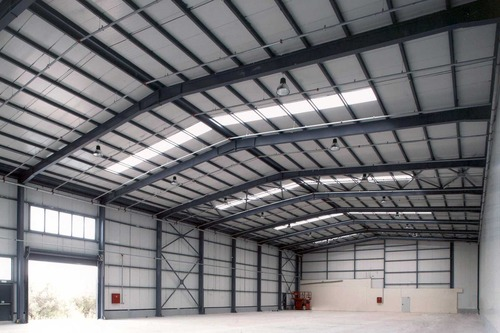
Evobus S.A. - interior view
{: .caption}

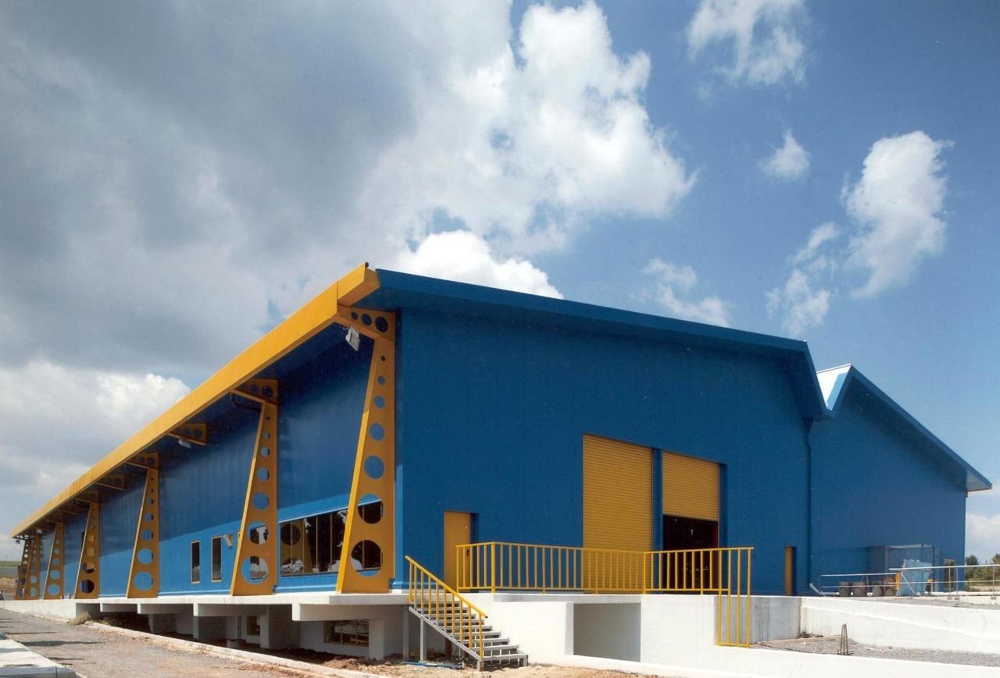
Filianos S.A. - exterior view
{: .caption}

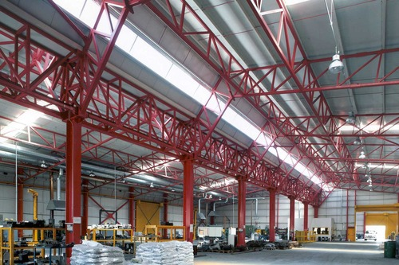
Filianos S.A. - interior view
{: .caption}

Krivek S.A. - exterior view
{: .caption}

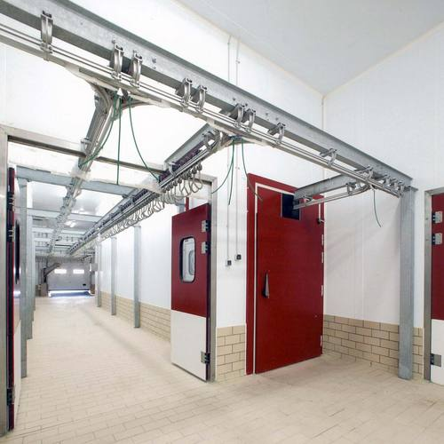
Krivek S.A. - interior view
{: .caption}

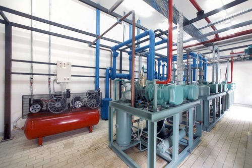
Krivek S.A. - interior view
{: .caption}

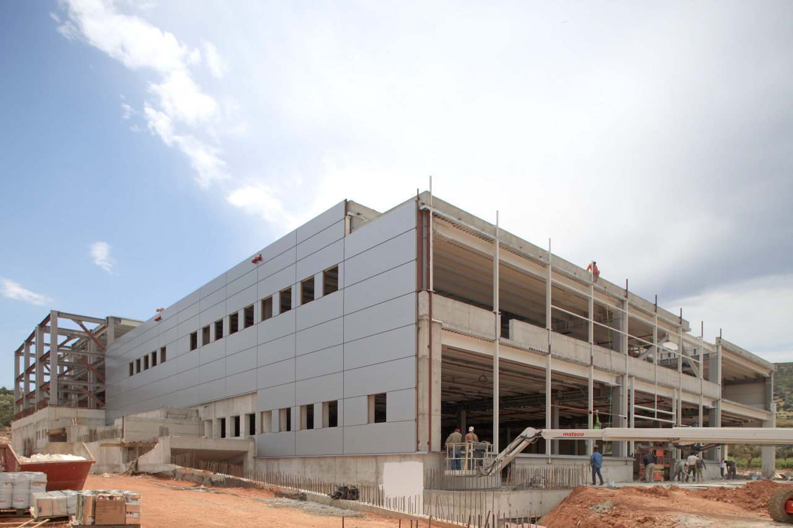
Media Strom S.A. - exterior view
{: .caption}

Media Strom S.A. - interior view
{: .caption}

Kteo Kifisias S.A. - exterior view
{: .caption}

Kafea S.A. - exterior view
{: .caption}

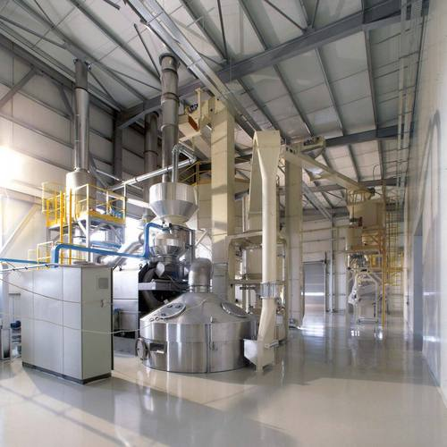
Kafea S.A. - interior view
{: .caption}

Kafea S.A. - interior view
{: .caption}

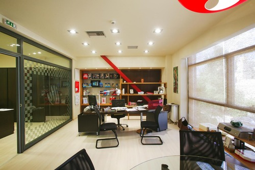
Kafea S.A. - interior view
{: .caption}

Kafea S.A. - interior view
{: .caption}

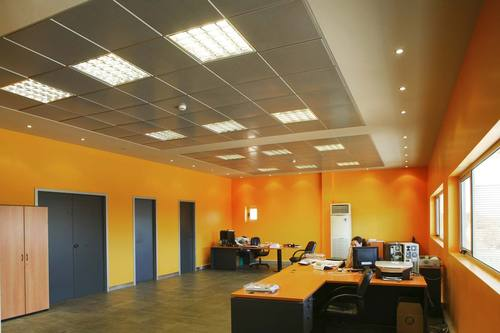
Kafea S.A. - interior view
{: .caption}

### Warehousing

| Project               | Size | Description |
|:--                    |:--   | :--         |
| Nireas S.A.           | Total area 620m2 | Fish product storage warehouse Koropi Industrial Zone |
| J&P Avax S.A.         | Total area 2,500m2 | Olympic Equestrian Center warehouse Markopoulo, Attiki |
| Lymberpa S.A.         | Total area 1,000m2 | Warehouse Koropi Industrial Zone |
| Ioannis Deloudis S.A. | Total area 3,000m2 | Furniture storage warehouse Avlonas, Attiki |
| Elmec Sport S.A.      | Total area 6,500m2 | Sports merchandise storage warehouse Koropi Industrial Zone |
| Koutsikos S.A.        | Total area 6,100m2 | Beverage storage warehouse Volos Industrial Zone |
| Amvyx S.A.            | Total area 3,800m2 | Beverage storage warehouse Markopoulo Industrial Zone |
| Pseka S.A.            | Total area 4,710m2 | Agricultural machinery warehouse Inoi, Viotia |
| Vekrakis Imports S.A. | Total area 4,200m2 | Retail product storage warehouse Ipato, Viotia |
| Cellco S.A.           | Total area 3,200m2 | Pharmaceuticals storage warehouse Markopoulo Industrial Zone |
| Intersys S.A.         | Total area 6,400m2 | Electronics storage warehouse Markopoulo Industrial Zone |

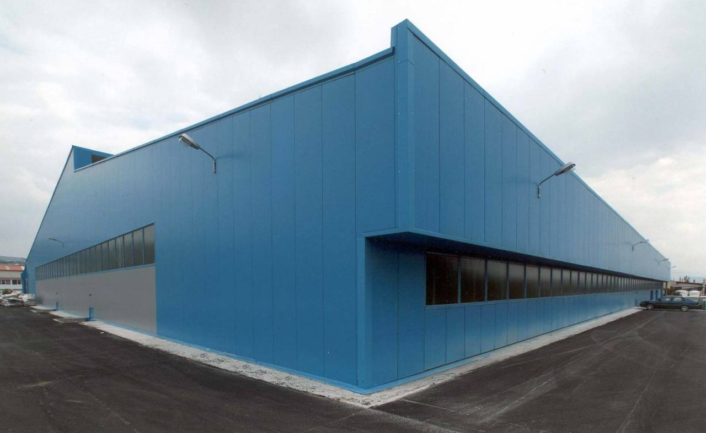
Nireas S.A. - exterior view
{: .caption}

Lymberpa S.A. - exterior view
{: .caption}

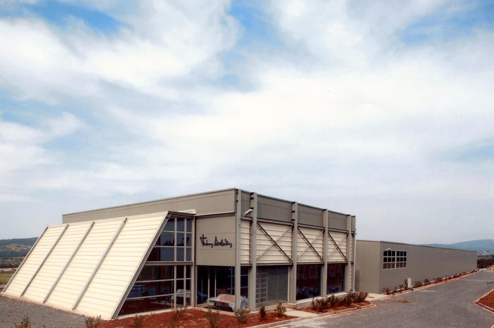
Ioannis Deloudis S.A. - exterior view
{: .caption}

Elmec Sport S.A. - exterior view
{: .caption}

Amvyx S.A. - exterior view
{: .caption}

Pseka S.A. - exterior view
{: .caption}

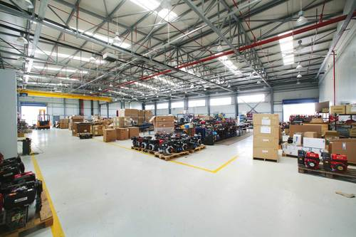
Pseka S.A. - interior view
{: .caption}

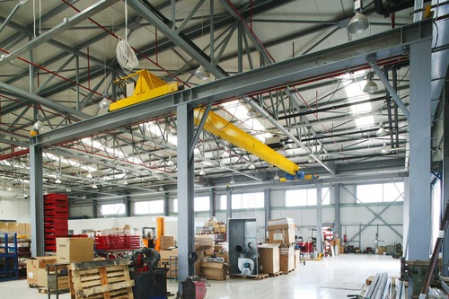
Pseka S.A. - interior view
{: .caption}

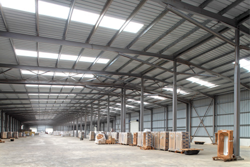
Pseka S.A. - interior view
{: .caption}

Pseka S.A. - interior view
{: .caption}

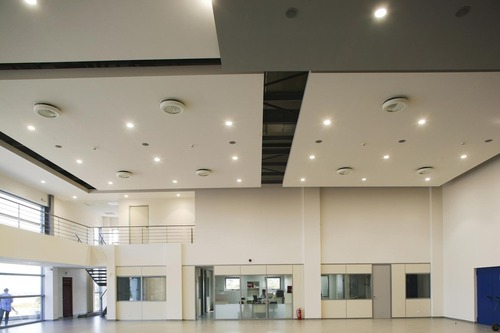
Pseka S.A. - interior view
{: .caption}

Vekrakis Imports S.A. - exterior view
{: .caption}

Vekrakis Imports S.A. - interior view
{: .caption}

Vekrakis Imports S.A. - interior view
{: .caption}

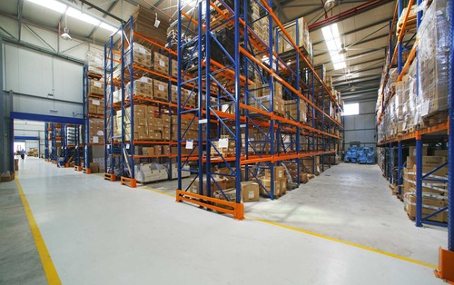
Vekrakis Imports S.A. - interior view
{: .caption}

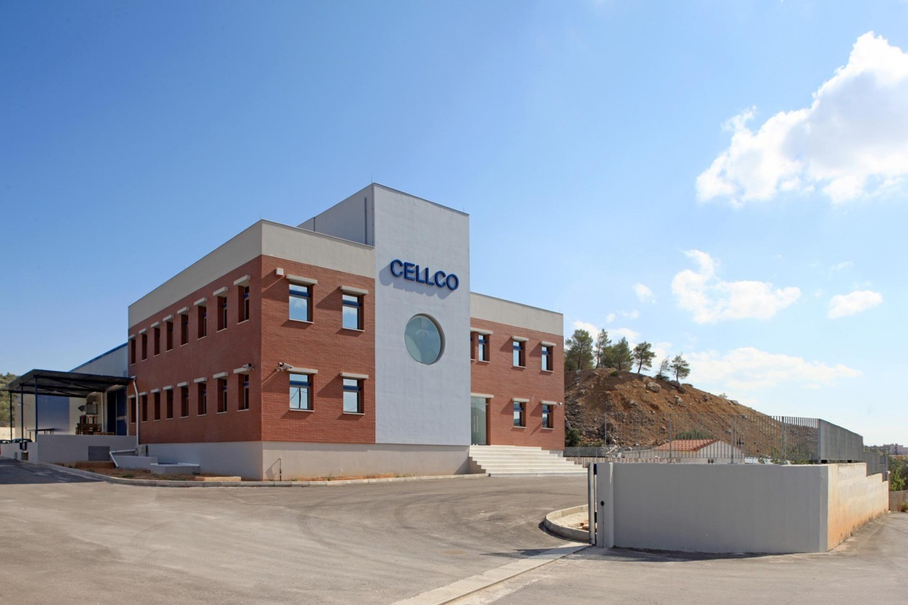
Cellco S.A. - exterior view
{: .caption}

Cellco S.A. - interior view
{: .caption}

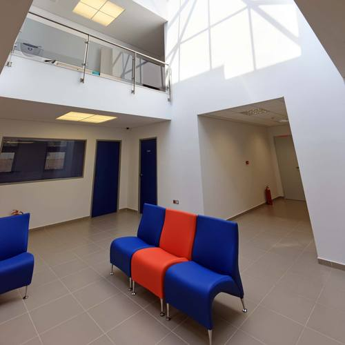
Cellco S.A. - interior view
{: .caption}

Intersys S.A. - exterior view
{: .caption}
