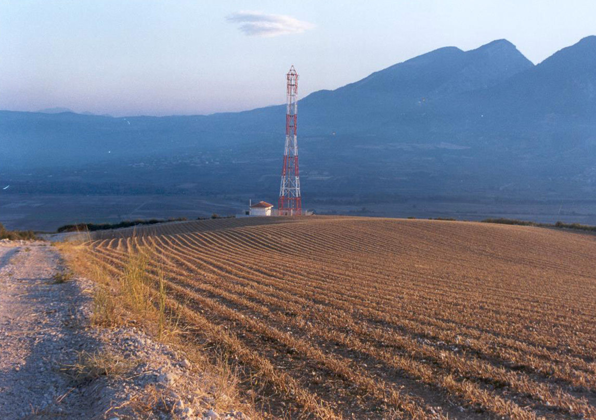
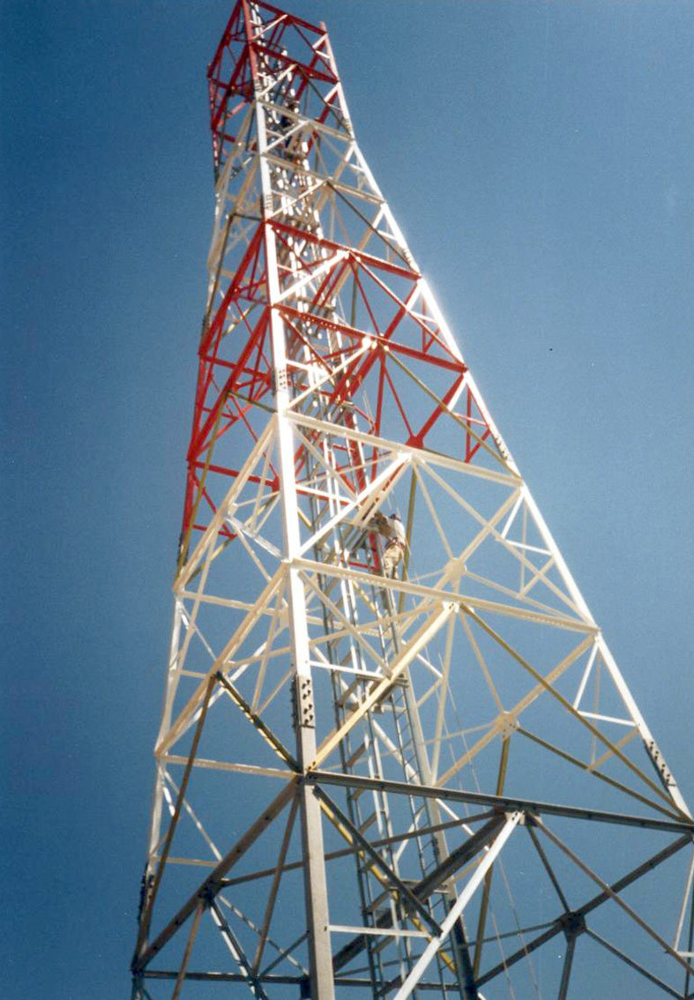
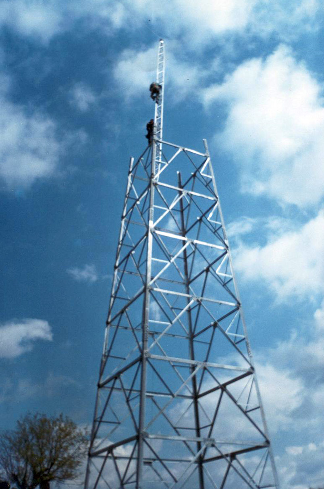
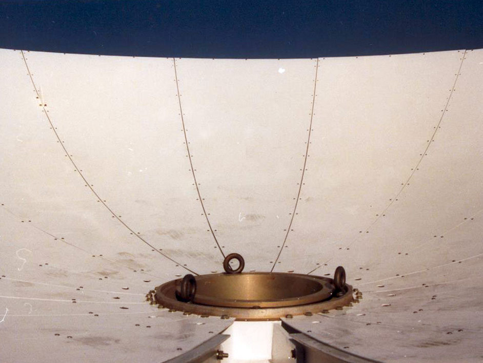
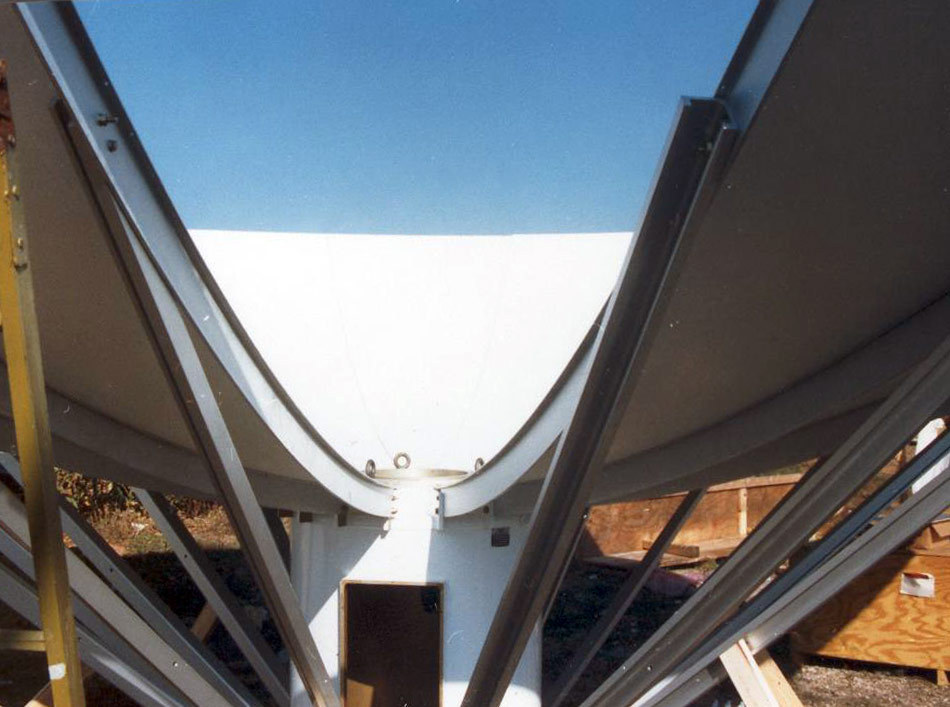

# Steel towers

Symmikton S.A. undertakes the construction and development of steel towers for telecom, television, and radio broadcast networks.

Our company was one of the three construction companies that undertook the development of the mobile telephony network of Cosmote in Greece. Within the context of mobile telephony expansion in the Balkans, our company also undertook the construction of 50% of the Albanian Mobile Communications (AMC) network in Albania, the Cosmo Bulgaria Mobile (Globul) network in Bulgaria, and the Cosmote Romanian Mobile Telecommunications (Cosmorom) network in Romania.

In the television broadcast network space, we undertook the construction and development of Mega Channel, the first private television network in Greece. For this project, our company managed to provide network coverage to 98% of the country in less than 2.5 years. We were also responsible for the maintenance of the broadcasting equipment and infrastructure for 4 years.

In the radio broadcast network space, we undertook the construction of radio station infrastructure, including studios and broadcast centers.

## Scope

Our scope of work in this field can be summarized as follows:

### Search & acquisition of location

* Surveying the location chosen by the planning team of the operator
* Assessing property ownership
* Signing private tenancy agreeements with owners
* Developing construction drawings
* Submitting drawings to local authorities towards the acquisition of a building permit

A telecom tower location developed by Symmikton
{: .caption}

### Construction & electromechanical works

* Road works (alignment, framing, earthworks)
* Concreting, foundation works and grounding system installation
* Tower construction (crane, falcone)
* Generator installation (BTS, generator containers)
* Colorcoding, light and central power panel installation
* Lightning protection and grounding system wiring

Telecom tower erection using a crane
{: .caption}

### Telecommunication works

* Evaluating station readiness through digital mapping
* Ordering equipment from vendors and delivering it to the site
* Installing and activating station and coupling equipment
* Integrating station into broader network (via coupling or leased lines)

## Projects

### Telecom

| Project  |Scope                                                              | Location |
|:--       |:--                                                                |:--       |
| Cosmote  | Mobile telephony towers                                           | Greece   |
| EMY      | Meteorological data processing tower                              | Greece   |
| Mercury  | Self-supporting steel lattice towers in radio monitoring stations | Greece   |
| AMC      | Mobile telephony towers                                           | Albania  |
| Globul   | Mobile telephony towers                                           | Bulgaria |
| Cosmorom | Mobile telephony towers                                           | Romania  |

### TV

| Project        | Scope                       | Location                              |
|:--             |:--                          |:--                                    |
| Mega Channel   | TV studios and offices      | Athens, Marousi, Peania, Thessaloniki |
| Mega Channel   | Microwave links             | Athens, Thessaloniki                  |
| Mega Channel   | Satellite receiving station | Peania                                |
| Mega Channel   | Broadcast centers           | 12 locations across Greece            |
| Mega Channel   | Repeaters                   | 19 locations across Greece            |

### Radio

| Project        | Scope                                 | Location         |
|:--             |:--                                    |:--               |
| Diesi FM       | Broadcast center                      | Imitos           |
| Skai FM        | Radio studio                          | Pallini          |
| Best FM        | Radio studio and broadcast center     | Psichiko, Imitos |
| Flash FM       | Radio studio and broadcast center     | Athens, Parnitha |
| Top FM         | Radio studio and broadcast center     | Athens, Parnitha |
| ERA            | Recording studio                      | Athens           |
| Pacific        | Recording studio                      | Vrilissia        |
| Prisma         | Recording studio                      | Galatsi          |
| Kitselidis     | Recording studio                      | Pagkrati         |
| Rex Music Hall | Comprehensive acoustic infrastructure | Athens           |
